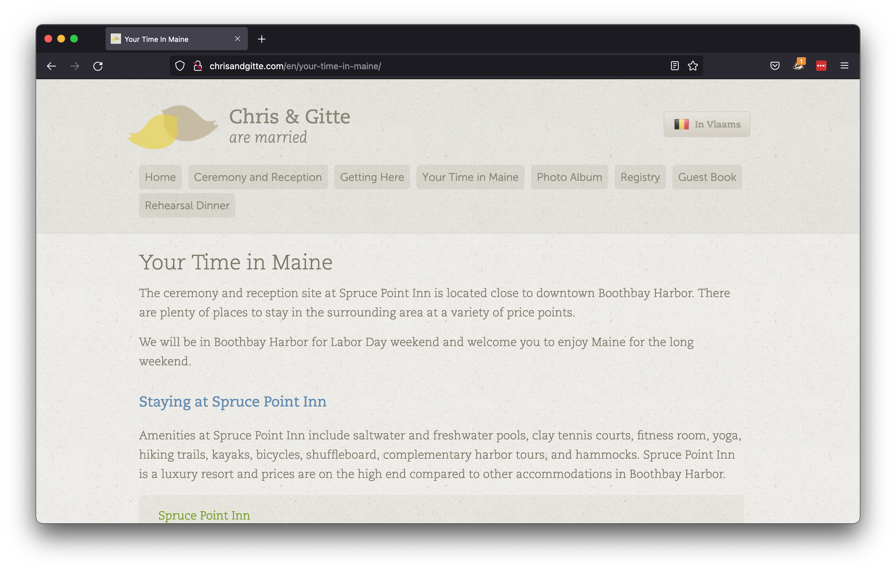

# chrisandgitte.com

> **NOTE**: This is an archive the original [chrisandgitte.com](http://chrisandgitte.com) website.
>
> Added to GitHub for the historical perspective. Code is outdated and not
> secure. Please do **not** try to run this.

The new version of this site is available at [chrisandgitte-homepage](https://github.com/chrislaskey/chrisandgitte-homepage).

## About

The website for our wedding, featuring:

- Multi-language support (English / Vlaams)
- A custom design
- Responsive HTML with [skeleton.css](http://www.getskeleton.com/)

Built with Python [Flask](http://flask.pocoo.org/).

## More screenshots

In Vlaams:

In English:

## License

All code written by me is released under MIT license. See the attached
license.txt file for more information, including commentary on license choice.
